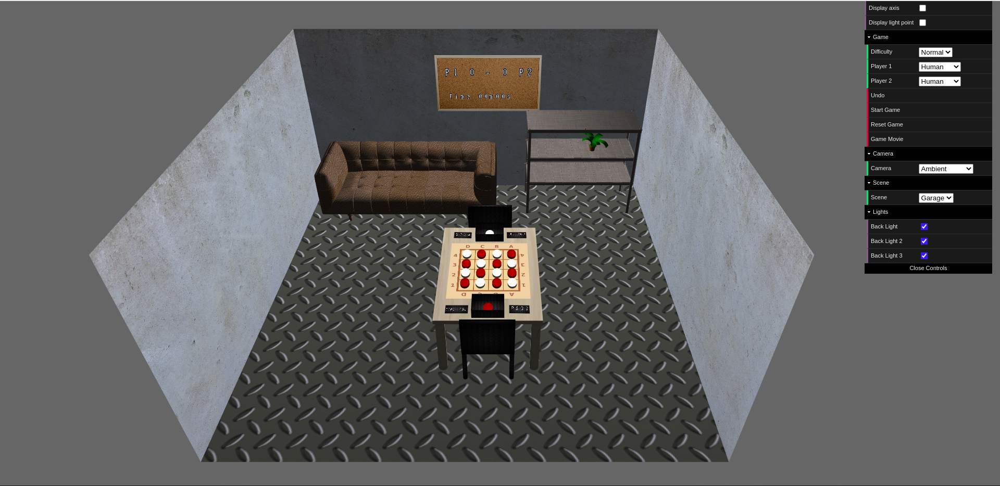
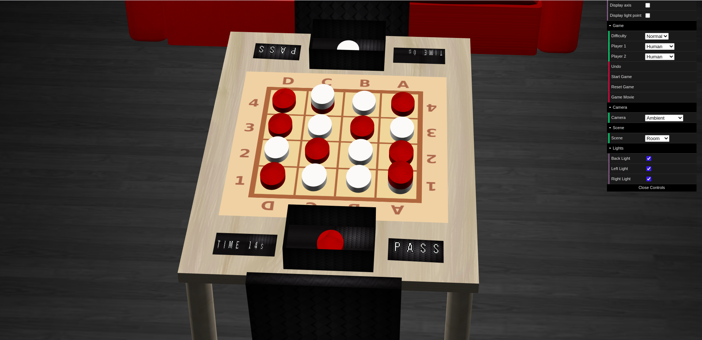

# feup-laig
 
This programs were created during the **1st semester** of the **3rd year** of **Integrated Master in Informatics and Computing Engineering**, in **Graphical Applications Laboratory** curricular unity (FEUP).

[LAIG FEUP-Sigarra](https://sigarra.up.pt/feup/en/UCURR_GERAL.FICHA_UC_VIEW?pv_ocorrencia_id=281214 "Curricular Unity Homepage")

## Contributors

All the work developed during this curricular unit was made side-by-side with [Marta Santos](https://github.com/martandradelobo "Github Profile").

----

## Projects

### [TP1 - Scene Graph - Times Square](TP1)

- Main strong points
  * All primitives defined
    * All with texture coordinates (triangle and rectange with afs/aft)
    * Torus, Cylinder and Sphere with all it's values (stacks, slices, loops, innerRadius and outerRadius, etc.)
  * Parser completed and with error checking, namely:
    * When there's no light defined in XML, the code adds one to be used by default
    * When there's no camera defined in XML, the code adds one to be used by default
    * When textures aren't defined in XML, the file doesn't exist or something else, the code doesn't apply it (ignores and just logs the error)
    * When materials aren't defined in XML or some error occurs, the code applied a default one
    * When a primitive isn't correctly defined or some error occurs, the code ignores and logs the error
  * Added a GUI checkbox to select whether the tiny white cube of a light is displayed or not

- Scene
  * Our scene is a Times Square replica, with...
    - ... three main buildings (all with publicity textures applied to two of their faces and one with an additional texture for the roof).
    - ... a street divided by a sidewalk with an USA flag and some flowers.
  * [Relative Link to Scene](https://git.fe.up.pt/laig/laig-2020-2021/t05/laig-t05-g02/-/blob/master/TP1/scenes/lsf_scheme.xml)

-----

### [TP2 - Animated Times Square](TP2)

- Main strong points
  * All primitives defined (including the Patch, Plane and defbarrel)
  * Keyframe Animation implemented and used both in Flag and Plane movement
  * SpriteText implemented and used in a sentence (with support for A-Z, a-z, 0-9 and some special characters)
  * SpriteAnimation implemented and used for both Pigeons
  * SpriteSheet implemented and used for SpriteText and SpriteAnimation
  * Use of textures in Road (now uses the Plane primitve and not the rectangle as in TP1), the middle building (not anymore a group of primitives; now is a single Patch) and in the Trash Can (new element based on defbarrel primitive)
  * Quick secene load time
  * Structured and organized code w/ all necessary comments
- Scene
  * Our scene is a Times Square replica, with...
    - ... three main buildings (one of them is a Patch; all have textures applied to).
    - ... a street (Plane) divided by a sidewalk with an USA Flag, flowers and a trash can. In the street, there are also two pigeons.
    - ... a plane that moves from right to left and from back to front
    - ... a sentence ("Welcome to Times Square!") that uses SpriteText
  * [Relative Link to Scene](https://git.fe.up.pt/laig/laig-2020-2021/t05/laig-t05-g02/-/blob/master/TP2/scenes/lsf_scheme.xml)

----

### [TP3 - 3D Interface for Swack game](TP3)

- Main strong points
  * New primitives for pieces (GamePiece and AuxiliarPiece) and for pass button (PassButton).
  * Animation of pieces in every play (from user or from computer).
  * Pieces change their color when clicked.
  * SpriteText used for game time and scorer (in score board) and for play time (for each player in it's turn, near the pass button).
  * Use of obj models w/ support in XML and Reader (leaf objfile). Obj models w/ textures applied.
  * Use of a variety of textures in both scenes (Room and Garage).
  * Both scenes w/ high visual detail w/o influencing load time too much.
  * Quick scene load time (for both scenes considering it's elements).
  * Organized and simple but efficient user interface (GUI) w/ all necessary options.
  * Swack class responsible for communication with PROLOG and for keep the variables necessary for gameplay and for game validation. 
  * Invalid move or winner of a game shown in an alert popup.
  * Possibility to see a movie of an end game.
  * Structured and organized code w/ all necessary comments.
- Scenes
  * Our Room scene is a room, with...
    - ... a couch and a cat on top of it.
    - ... a board with score and game time.
    - ... two lamps (left and right).
    - ... a table and two chairs. On top of the table, there's the board with all the pieces, a container w/ extra pieces for each player, a pass button for each player and the time of a play for each player too.
    - ... textures applied to both floor and walls.
  * [Relative Link to Room Scene](https://git.fe.up.pt/laig/laig-2020-2021/t05/laig-t05-g02/-/blob/master/TP3/scenes/room.xml)
  * Our Garage scene is a garage, with...
    - ... a couch.
    - ... a furniture and a plant
    - ... a board with score and game time.
    - ... a table and two chairs. On top of the table, there's the board with all the pieces, a container w/ extra pieces for each player, a pass button for each player and the time of a play for each player too.
    - ... textures applied to both floor and walls.
  * [Relative Link to Garage Scene](https://git.fe.up.pt/laig/laig-2020-2021/t05/laig-t05-g02/-/blob/master/TP3/scenes/garage.xml)

#### Some pictures of the 3D Interface

- Garage Scene

- Room Scene

- Board and Pieces

- Scoreboard

