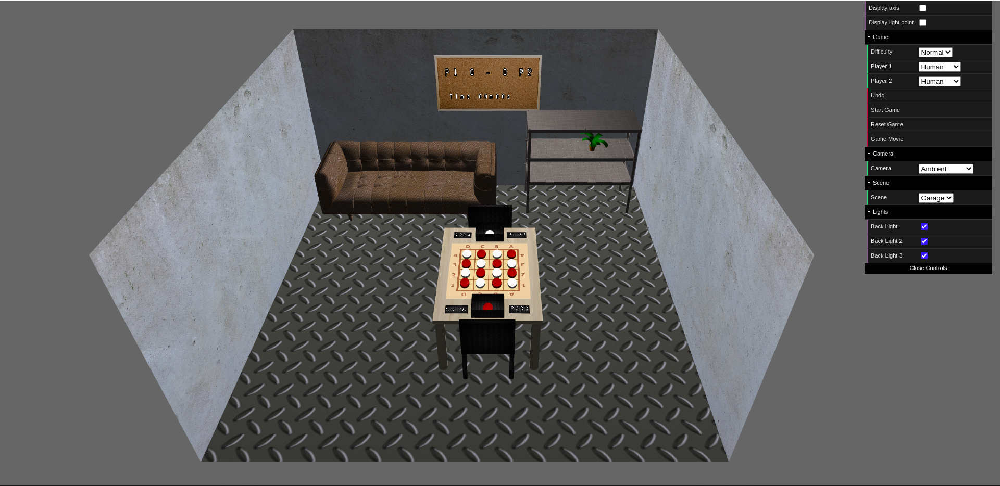
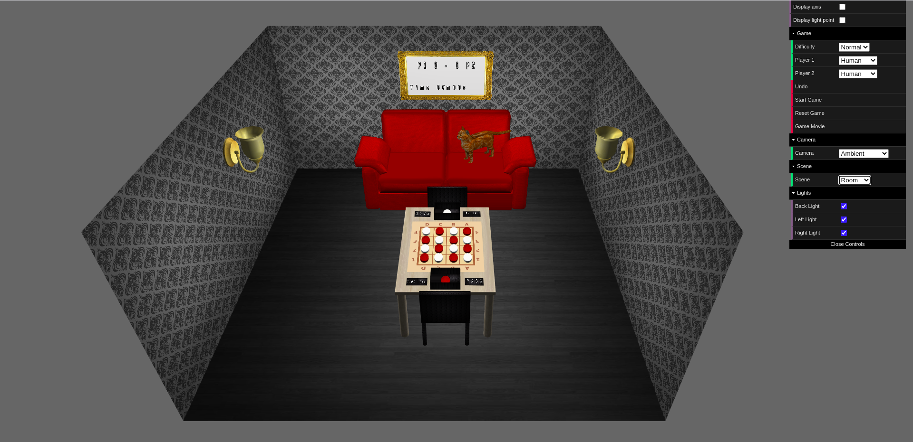
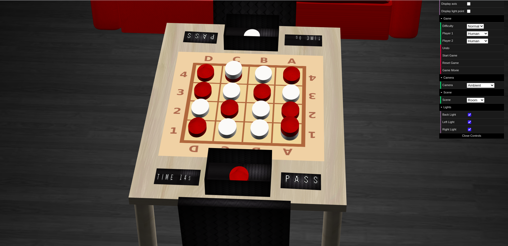
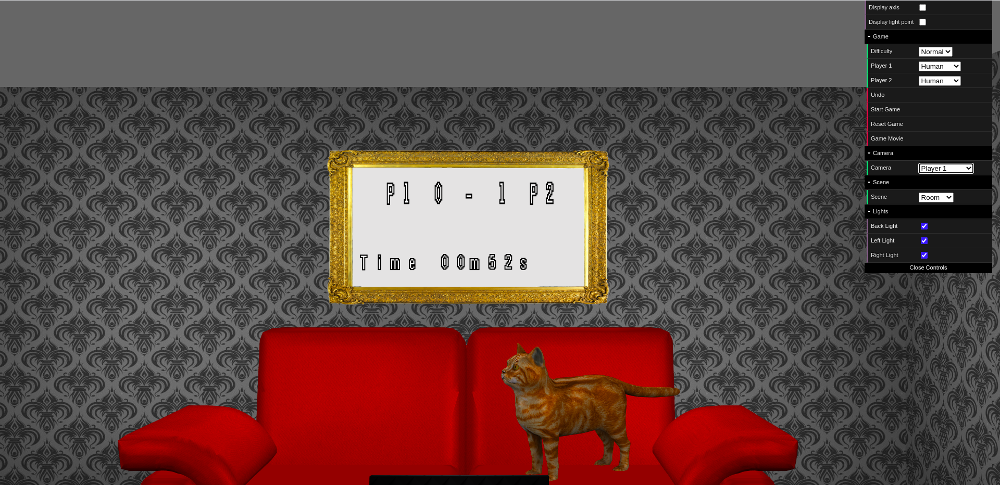

# LAIG 2020/2021 - TP3

## Group T05G02

| Name                | Number    | E-Mail               |
| ------------------- | --------- | -------------------- |
| João Carlos Pires   | 201806079 | up201806079@fe.up.pt |
| Maria Marta Santos  | 201604530 | up201604530@fe.up.pt |

----

## Project information

- Main strong points
  * New primitives for pieces (GamePiece and AuxiliarPiece) and for pass button (PassButton).
  * Animation of pieces in every play (from user or from computer).
  * Pieces change their color when clicked.
  * SpriteText used for game time and scorer (in score board) and for play time (for each player in it's turn, near the pass button).
  * Use of obj models w/ support in XML and Reader (leaf objfile). Obj models w/ textures applied.
  * Use of a variety of textures in both scenes (Room and Garage).
  * Both scenes w/ high visual detail w/o influencing load time too much.
  * Quick scene load time (for both scenes considering it's elements).
  * Organized and simple but efficient user interface (GUI) w/ all necessary options.
  * Swack class responsible for communication with PROLOG and for keep the variables necessary for gameplay and for game validation. 
  * Invalid move or winner of a game shown in an alert popup.
  * Possibility to see a movie of an end game.
  * Structured and organized code w/ all necessary comments.

- Scenes
  * Our Room scene is a room, with...
    - ... a couch and a cat on top of it.
    - ... a board with score and game time.
    - ... two lamps (left and right).
    - ... a table and two chairs. On top of the table, there's the board with all the pieces, a container w/ extra pieces for each player, a pass button for each player and the time of a play for each player too.
    - ... textures applied to both floor and walls.
  * [Relative Link to Room Scene](https://git.fe.up.pt/laig/laig-2020-2021/t05/laig-t05-g02/-/blob/master/TP3/scenes/room.xml)
  * Our Garage scene is a garage, with...
    - ... a couch.
    - ... a furniture and a plant
    - ... a board with score and game time.
    - ... a table and two chairs. On top of the table, there's the board with all the pieces, a container w/ extra pieces for each player, a pass button for each player and the time of a play for each player too.
    - ... textures applied to both floor and walls.
  * [Relative Link to Garage Scene](https://git.fe.up.pt/laig/laig-2020-2021/t05/laig-t05-g02/-/blob/master/TP3/scenes/garage.xml)

----

## Issues/Problems

- The rotation of camera from Player 1 camera to Player 2 camera has a slightly error sometimes. By the end of the rotation, the camera is on the right position, but the movement is sometimes a litte bit strange.
- The moved pieces don't cross each other, but the one that comes from outside the board, sometimes, depending of the size of the game stacks, cross some pieces.

----

## Some pictures of the 3D Interface

- Garage Scene

- Room Scene

- Board and Pieces

- Scoreboard

